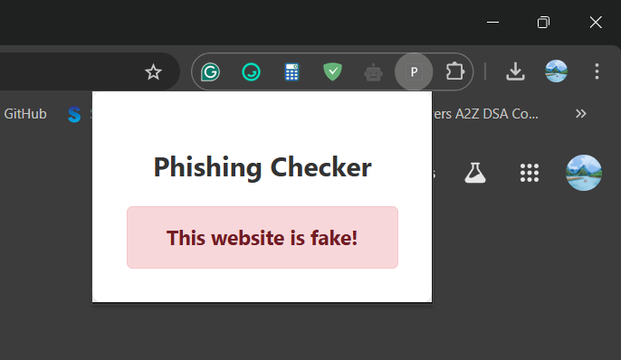

# KavachAI - Phishing Website Detection Browser Extension

KavachAI is a Phishing Website Detection Browser Extension that classifies URLs as **legitimate**, **suspicious**, or **fraudulent** using multiple techniques. The system analyzes URLs based on various parameters such as IP address detection, URL length, SSL certificate checks, and more. It provides a simple API for processing URLs and returning their phishing status.

## Screenshot

**KavachAI** Chrome Extension Pop-up interface:

## Features

This system uses the following **16 parameters** to classify URLs:

1. **IP Address Detection**: Checks if the domain is an IP address.
2. **URL Length**: Flags URLs that are too short or too long.
3. **Presence of '@' Symbol**: Identifies URLs containing the '@' symbol.
4. **Prefix/Suffix Detection**: Checks if a URL's domain has any prefixes or suffixes.
5. **Subdomain and Multi-Subdomain Detection**: Identifies domains with excessive subdomains.
6. **SSL/HTTPS Verification**: Checks if the site uses a valid SSL certificate from a trusted issuer.
7. **Request URL Analysis**: Analyzes external links in the webpage.
8. **Anchor Tag URL**: Detects suspicious anchor tags containing certain URLs.
9. **Form Action Verification**: Verifies if forms on the page submit data to a different domain.
10. **Google Index Check**: Verifies if the URL is indexed by Google.
11. **Age of Domain**: Checks the age of the domain; newer domains might be suspicious.
12. **DNS Record**: Verifies if a DNS record exists for the domain.
13. **Port Check**: Checks if the URL uses an unusual port for HTTP/HTTPS traffic.
14. **OnMouseOver Event**: Detects the use of suspicious `onmouseover` events.
15. **Link in Meta, Script, and Link Tags**: Checks external links in the `<meta>`, `<script>`, and `<link>` tags.
16. **Server Form Handler**: Verifies if forms on the page submit data to an external server.

## Technologies Used

- **Python**: The primary programming language used for the project.
- **Flask**: A micro web framework for creating the API.
- **Joblib**: For loading the pre-trained machine learning model.
- **BeautifulSoup**: For HTML parsing and extracting URLs.
- **Scikit-learn**: For machine learning and prediction.